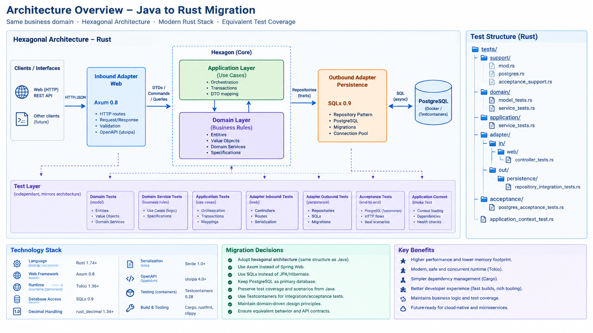
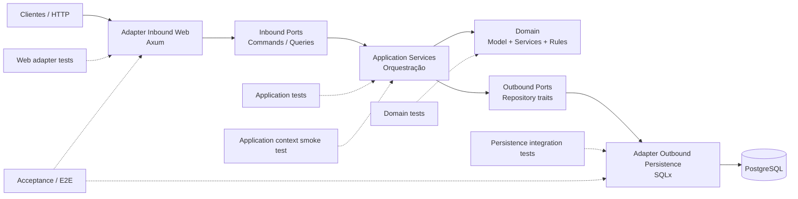
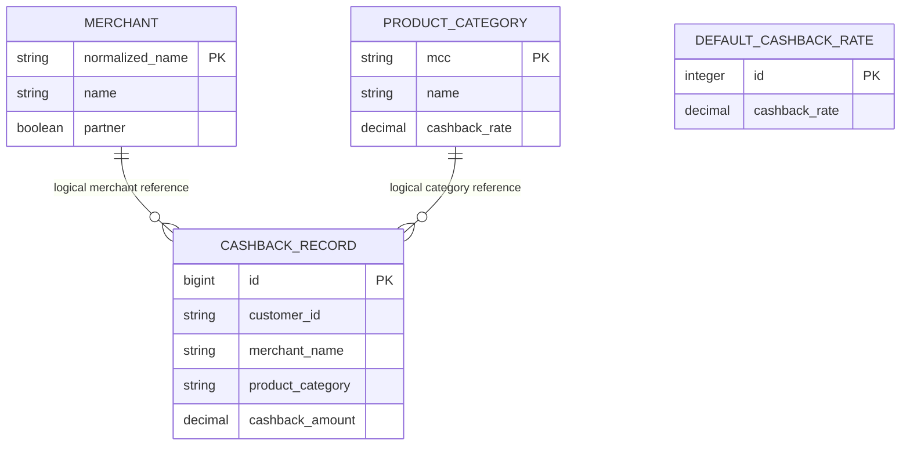
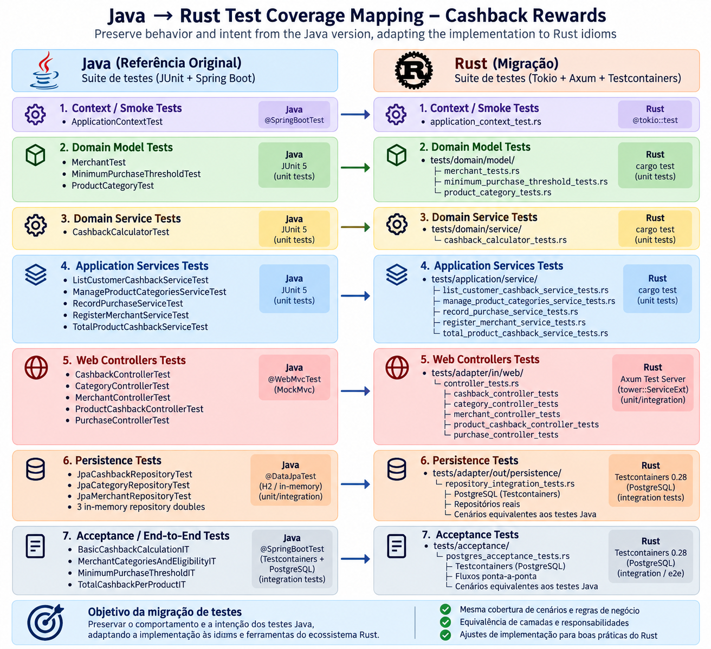

# Cashback Rewards — Migração Java → Rust

> Documento de arquitetura, decisões de migração, estratégia de testes e rastreabilidade da suíte entre o projeto Java de referência e o projeto Rust.

## 1. Objetivo e escopo

Este documento registra a migração do projeto **Serenity Dojo Cashback Rewards** da implementação Java/Spring Boot para Rust, preservando:

- as regras de negócio e o comportamento observável da aplicação;
- os contratos HTTP e os principais cenários de aceitação;
- a separação de responsabilidades da arquitetura hexagonal/Ports & Adapters;
- a intenção da suíte de testes Java;
- a rastreabilidade dos testes Java para equivalentes Rust;
- particularidades idiomáticas do ecossistema Rust, em vez de reproduzir mecanicamente APIs de Spring/JPA.

A referência funcional da migração é a branch `section-13/solution` do repositório Java:

- <https://github.com/serenity-dojo/cashback-rewards/tree/section-13/solution>

O projeto Rust é:

- <https://github.com/israelsantiago/cashback-rewards-rust>

### Regra de ouro da migração

**Preservar comportamento e intenção; adaptar a implementação para as melhores práticas e idioms do Rust.**

Isso significa que uma diferença entre Java e Rust é aceitável quando ela é consequência da stack, do modelo de execução ou das convenções da linguagem, desde que o comportamento funcional e a responsabilidade arquitetural sejam equivalentes.

---

## 2. Resumo executivo da arquitetura

A solução Rust mantém o desenho hexagonal do projeto Java, reorganizando apenas os mecanismos tecnológicos:

| Responsabilidade | Java de referência | Rust migrado |
|---|---|---|
| Linguagem | Java | Rust |
| Web | Spring Web / MVC | Axum 0.8 |
| Runtime assíncrono | Spring/Tomcat | Tokio |
| Aplicação | Services / ports | Application services + inbound/outbound ports |
| Domínio | POJOs/records/services | structs, enums, traits e domain services |
| Persistência | JPA/Hibernate | SQLx 0.9 |
| Banco | PostgreSQL | PostgreSQL |
| Migrações | Flyway | SQLx migrations |
| Precisão monetária | `BigDecimal` | `rust_decimal::Decimal` |
| JSON | Jackson | Serde / serde_json |
| OpenAPI | Spring/OpenAPI | utoipa + Swagger UI |
| Testes unitários | JUnit 5 | `cargo test` |
| Testes HTTP | MockMvc | Axum Router + `tower::ServiceExt::oneshot` |
| Banco em integração | `@DataJpaTest` + PostgreSQL | Testcontainers + PostgreSQL |
| Runtime / concorrência | JVM | Tokio + Rust async |

O projeto usa **Ports & Adapters / Hexagonal Architecture com princípios de Clean Architecture**. Não é necessário forçar uma interpretação puramente acadêmica de Clean Architecture; o elemento preservado é a direção das dependências e o isolamento do domínio.

---

## 3. Diagrama arquitetural

A visão gráfica abaixo é parte deste projeto e está em `docs/diagrams/`.



### Diagrama editável em Mermaid



### Direção das dependências

```text
Adapters / Web / Tests
        |
        v
Application
        |
        v
Domain
```

O domínio não deve conhecer Axum, SQLx, PostgreSQL, Tokio ou detalhes de transporte HTTP.

---

## 4. Estrutura física do projeto Rust

A estrutura física foi alinhada ao conceito de pacotes do projeto Java:

```text
src/
├── adapter/
│   ├── in/
│   │   └── web/
│   │       ├── cashback_controller.rs
│   │       ├── category_controller.rs
│   │       ├── merchant_controller.rs
│   │       ├── product_cashback_controller.rs
│   │       └── purchase_controller.rs
│   └── out/
│       └── persistence/
│           ├── cashback_repository.rs
│           ├── category_repository.rs
│           └── merchant_repository.rs
├── application/
│   ├── port/
│   │   ├── in/
│   │   └── out/
│   └── service/
├── domain/
│   ├── exception/
│   ├── model/
│   └── service/
└── main.rs

tests/
├── domain/
│   ├── model/
│   └── service/
├── application/
│   └── service/
├── adapter/
│   ├── in/
│   │   └── web/
│   └── out/
│       └── persistence/
├── acceptance/
├── support/
└── application_context_test.rs
```

### Observação sobre `in`

`in` é palavra reservada do Rust em determinados contextos de parsing/mod declaration. Por isso o módulo correspondente usa `r#in` nas declarações de módulo/imports quando necessário. A pasta física permanece `in`, preservando a intenção arquitetural do Java.

---

## 5. Camadas e responsabilidades

### 5.1 Domain

Contém somente o conhecimento do negócio:

- `Merchant`;
- `ProductCategory`;
- `CashbackRecord`;
- `ProductCashbackTotal`;
- `MinimumPurchaseThreshold`;
- `CashbackCalculator`;
- exceções/erros de domínio.

Regras preservadas:

- merchant parceiro pode gerar cashback;
- merchant não parceiro não gera cashback;
- nomes de merchant são normalizados por `trim + lowercase` para lookup;
- MCC mapeado usa a taxa da categoria;
- MCC não mapeado usa categoria `Other` e taxa default;
- compras abaixo de `1.00` não geram cashback;
- cashback é calculado com arredondamento `HALF_EVEN` em duas casas;
- total por categoria soma os cashback records;
- quantidade de registros é preservada;
- total de categoria sem registros mantém escala monetária 2.

### 5.2 Application

Orquestra os casos de uso sem conhecer HTTP nem SQLx:

- registrar merchant;
- gerenciar categorias/taxas;
- registrar purchase;
- listar cashback do cliente;
- obter total de cashback por produto/categoria.

As portas são expressas como traits, permitindo doubles mínimos nos testes unitários.

### 5.3 Adapter Inbound / Web

Responsável por:

- rotas HTTP;
- DTOs de request/response;
- desserialização/serialização;
- conversão de erros de aplicação para HTTP;
- documentação OpenAPI.

A camada web não deve conter regras de negócio.

### 5.4 Adapter Outbound / Persistence

Responsável por traduzir as portas de persistência para SQLx/PostgreSQL:

- merchant repository;
- category repository;
- cashback repository;
- connection pool;
- migrations.

SQLx foi escolhido em vez de ORM para manter SQL explícito, tipagem e menor abstração entre aplicação e banco.

---

## 6. Tecnologias e decisões

### Rust

O `Cargo.toml` da migração utiliza Rust edition 2024 e `rust-version = "1.94"`. Rust 1.94.0 foi lançado oficialmente em 5 de março de 2026; 1.94.1 foi lançado em 26 de março de 2026 com correções de regressões do 1.94.0 e atualização de Cargo relacionada a segurança. [Rust Blog](https://blog.rust-lang.org/2026/03/05/Rust-1.94.0/) · [Rust 1.94.1](https://blog.rust-lang.org/2026/03/26/1.94.1-release/)

### Axum

Axum fornece o adapter HTTP com handlers assíncronos e composição via `Router`. O projeto permanece com handlers finos, equivalentes conceitualmente aos controllers Spring.

Referência: <https://docs.rs/axum/>

### Tokio

Tokio é o runtime para o modelo async/await usado pelos adapters e testes assíncronos.

Referência: <https://tokio.rs/>

### SQLx

SQLx 0.9 é usado para PostgreSQL e migrations embutidas/gerenciadas pelo crate. A macro `sqlx::migrate!` embute o diretório de migrations a partir da raiz do projeto, e os arquivos devem usar prefixo de versão numérico interpretável como `i64`. [Docs.rs](https://docs.rs/sqlx/latest/sqlx/macro.migrate.html) · [Migration module](https://docs.rs/sqlx/latest/sqlx/migrate/)

### rust_decimal

`Decimal` preserva precisão exata para taxas e valores monetários e evita `f64` em lógica financeira.

### Serde / serde_json

Usado para DTOs e JSON. Uma particularidade da suíte Rust é que `serde_json::Value` distingue a representação numérica `2.4` de `2.40`; os asserts da suíte devem construir o JSON esperado de forma a preservar a escala quando ela faz parte do contrato.

### Testcontainers

Testcontainers 0.28.0 é usado para os testes que precisam de PostgreSQL real. A documentação do crate apresenta explicitamente esse uso para testes de integração de persistência e disponibiliza API síncrona e assíncrona; a suíte utiliza a API assíncrona com `AsyncRunner`. [Docs.rs](https://docs.rs/crate/testcontainers/0.28.0)

### utoipa

Gera OpenAPI a partir dos tipos/handlers Rust e mantém a documentação da API próxima do código.

---

## 7. Banco de dados e migrations

O modelo PostgreSQL foi preservado conceitualmente:



Migrations do projeto:

```text
migrations/
├── 01_create_merchant_table.sql
├── 02_create_product_category_table.sql
└── 03_create_cashback_record_table.sql
```

A numeração é intencional: SQLx exige nomes cujo prefixo de versão possa ser interpretado como `i64`. Isso substitui o padrão Flyway `V1__...` do Java.

---

## 8. Test strategy: equivalência Java → Rust

### Resultado da análise de rastreabilidade

A suíte Java de referência contém **22 classes/testes de contexto** nas seguintes camadas:

- 1 smoke/context;
- 4 domain;
- 5 application service;
- 5 web controller;
- 3 persistence repository;
- 4 acceptance/integration.

Os três `InMemory*Repository` Java são doubles de teste, não testes independentes.

A migração preserva essas responsabilidades no Rust, consolidando alguns casos em módulos de teste maiores quando isso é mais idiomático para Rust.



### Matriz de rastreabilidade

| Java | Responsabilidade preservada | Rust |
|---|---|---|
| `CashbackRewardsApplicationTests` | smoke/context | `tests/application_context_test.rs` |
| `MerchantTest` | modelo Merchant | `tests/domain/model/merchant_test.rs` |
| `MinimumPurchaseThresholdTest` | threshold | `tests/domain/model/minimum_purchase_threshold_test.rs` |
| `ProductCategoryTest` | modelo/category | `tests/domain/model/product_category_test.rs` |
| `CashbackCalculatorTest` | cálculo + rounding | `tests/domain/service/cashback_calculator_test.rs` |
| `ListCustomerCashbackServiceTest` | use case de consulta | `tests/application/service/application_service_tests.rs` |
| `ManageProductCategoriesServiceTest` | categorias/default rate | `tests/application/service/application_service_tests.rs` |
| `RecordPurchaseServiceTest` | purchase/cashback/eligibility | `tests/application/service/application_service_tests.rs` |
| `RegisterMerchantServiceTest` | registro/duplicidade | `tests/application/service/application_service_tests.rs` |
| `TotalProductCashbackServiceTest` | total + count + scale 2 | `tests/application/service/application_service_tests.rs` |
| `CashbackControllerTest` | GET customer cashback | `tests/adapter/in/web/controller_tests.rs` |
| `CategoryControllerTest` | POST/PUT category | `tests/adapter/in/web/controller_tests.rs` |
| `MerchantControllerTest` | POST merchant | `tests/adapter/in/web/controller_tests.rs` |
| `ProductCashbackControllerTest` | total por produto | `tests/adapter/in/web/controller_tests.rs` |
| `PurchaseControllerTest` | POST purchase | `tests/adapter/in/web/controller_tests.rs` |
| `JpaCashbackRepositoryTest` | lookup, filtro, total, zero, count | `tests/adapter/out/persistence/repository_integration_tests.rs` |
| `JpaCategoryRepositoryTest` | MCC, default rate, overwrite | `tests/adapter/out/persistence/repository_integration_tests.rs` |
| `JpaMerchantRepositoryTest` | lookup + normalização | `tests/adapter/out/persistence/repository_integration_tests.rs` |
| `BasicCashbackCalculationIT` | parceiro vs não parceiro + cálculo | `tests/acceptance/postgres_acceptance_tests.rs` |
| `MerchantCategoriesAndEligibilityIT` | MCC + default category/rate | `tests/acceptance/postgres_acceptance_tests.rs` |
| `MinimumPurchaseThresholdIT` | threshold | `tests/acceptance/postgres_acceptance_tests.rs` |
| `TotalCashbackPerProductIT` | aggregate total/count | `tests/acceptance/postgres_acceptance_tests.rs` |

### Test doubles Java → Rust

Java:

```text
InMemoryMerchantRepository
InMemoryCategoryRepository
InMemoryCashbackRepository
```

Rust:

- doubles/stubs pequenos implementando as outbound ports;
- `Arc`, `Mutex` e structs de teste quando necessário para compartilhar estado entre chamadas async;
- Testcontainers somente onde o objetivo é validar a implementação de persistência/integração real.

Isso preserva uma distinção importante:

```text
Application service tests
        ↓
  doubles / stubs

Persistence integration tests
        ↓
 PostgreSQL real
```

Não é desejável tornar todos os testes de application services dependentes de Docker/PostgreSQL.

---

## 9. Particularidades de stack Rust preservadas na migração

### 9.1 JPA → SQLx

Não existe uma tentativa de reproduzir `@Entity`, `@Repository` ou `EntityManager` em Rust. A equivalência está no contrato de porta e no comportamento do adapter.

### 9.2 Spring MVC / MockMvc → Axum + `tower::ServiceExt`

Os controllers são testados construindo o `Router` e executando requests através de `oneshot`. Isso mantém o teste próximo do adapter real sem iniciar um servidor TCP.

### 9.3 `BigDecimal` → `Decimal`

A precisão monetária é preservada, incluindo a regra de arredondamento `HALF_EVEN` no cálculo.

### 9.4 `@DataJpaTest` → Testcontainers PostgreSQL

Em vez de depender de substituição de banco pelo framework, o adapter é exercitado contra PostgreSQL real em container efêmero. O Testcontainers documenta esse uso como cenário típico para testes de persistência. [Docs.rs](https://docs.rs/crate/testcontainers/0.28.0)

### 9.5 `@ParameterizedTest` → tabelas/loops explícitos

Casos parametrizados Java podem ser representados por arrays/iteradores em Rust, preservando a cobertura sem introduzir framework adicional.

### 9.6 Exceções Java → `Result<T, E>`

Fluxos de erro são valores explícitos. `thiserror` é utilizado para erros tipados, reduzindo dependência de exceções implícitas.

### 9.7 Dependency injection → construção explícita

A composição de dependências fica visível no código de bootstrap/router. Isso substitui parte da magia de component scanning do Spring.

---

## 10. Particularidade importante: escala decimal no JSON

A suíte encontrou uma diferença específica do Rust:

```text
API: 2.40
assert esperado: 2.4
```

Assim como:

```text
API: 4.00
assert esperado: 4.0
```

`serde_json::Value` considera essas representações numéricas diferentes. A implementação deve preservar o contrato monetário de duas casas; o teste deve preservar a mesma representação ao construir o `Value` esperado.

Prática adotada:

```rust
let expected: Value = serde_json::from_str(
    r#"{"totalCashback":4.00}"#
).unwrap();
```

Não alterar o domínio apenas para satisfazer a representação acidental de um literal `json!`.

---

## 11. API preservada

Endpoints preservados no port:

```text
POST /api/merchants
POST /api/categories
PUT  /api/categories/default-rate
POST /api/purchases
GET  /api/customers/{customerId}/cashback
GET  /api/products/{productCategory}/cashback-total
```

Também foi preservado o `Instant purchasedAt` do caso de uso de purchase, mesmo quando ele não participa diretamente do cálculo atual.

O relatório mensal descrito na documentação/OpenAPI upstream não foi inventado no Rust porque não existe como endpoint implementado na produção da branch Java de referência. A documentação deve continuar explicitando essa diferença.

---

## 12. Critérios de equivalência

Uma migração é considerada equivalente quando satisfaz simultaneamente:

1. **Comportamento** — as regras de negócio produzem os mesmos resultados.
2. **Contratos** — endpoints, payloads e respostas essenciais permanecem compatíveis.
3. **Responsabilidades** — domain, application e adapters continuam separados.
4. **Cobertura** — cada cenário material da suíte Java possui um teste Rust correspondente.
5. **Infraestrutura** — persistência real continua sendo validada contra PostgreSQL.
6. **Testabilidade** — application services continuam testáveis sem banco real.

Não é requisito de equivalência:

- copiar anotações Java;
- reproduzir classes de infraestrutura sem necessidade;
- usar um ORM para “parecer” com JPA;
- manter o mesmo framework de mocking;
- manter exatamente a mesma quantidade de arquivos de teste.

---

## 13. Execução completa da suíte Rust

### Pré-requisitos

- Rust/Cargo instalado via rustup;
- Docker Engine funcional para Testcontainers/PostgreSQL;
- checkout limpo ou com alterações conscientemente controladas.

### Formatação

```bash
cargo fmt --all
```

Verificação sem modificar arquivos:

```bash
cargo fmt --all -- --check
```

### Check de compilação

```bash
cargo check --workspace --all-targets --all-features
```

### Build completo

```bash
cargo build --workspace --all-targets --all-features
```

Build otimizado:

```bash
cargo build --workspace --all-targets --all-features --release
```

### Compile todos os testes sem executar

```bash
cargo test --workspace --all-targets --all-features --no-run
```

### Suíte padrão

```bash
cargo test --workspace --all-targets
```

### Suíte completa, incluindo `postgres-acceptance`

```bash
cargo test --workspace --all-targets --all-features -- --test-threads=1
```

A opção `--test-threads=1` é usada na validação de integração com banco para simplificar isolamento, logs e troubleshooting. Não é uma exigência funcional da arquitetura.

### Testes de documentação

```bash
cargo test --workspace --doc --all-features
```

### Clippy

```bash
cargo clippy --workspace --all-targets --all-features -- -D warnings
```

### Geração da documentação Rust

```bash
cargo doc --workspace --no-deps --all-features
```

A saída fica em `target/doc/`.

### Auditoria opcional de dependências

Se `cargo-audit` estiver instalado:

```bash
cargo audit
```

---

## 14. Gate completo recomendado

O projeto inclui `scripts/verify-rust-suite.sh`, que automatiza a sequência principal.

Execução direta:

```bash
chmod +x scripts/verify-rust-suite.sh && ./scripts/verify-rust-suite.sh
```

Sequência conceitual:

```text
cargo fmt --check
      ↓
cargo check
      ↓
cargo build
      ↓
cargo test --no-run
      ↓
cargo test default
      ↓
cargo test --all-features (PostgreSQL/Testcontainers)
      ↓
cargo clippy -D warnings
      ↓
cargo doc
```

Qualquer falha interrompe o pipeline.

---

## 15. Estado de verificação da migração

### Verificação estrutural

A rastreabilidade das 22 classes/testes Java foi definida e mapeada para os módulos Rust correspondentes. O script de refatoração também verifica diretórios, imports antigos e algumas condições semânticas conhecidas.

### Verificação funcional já observada

Durante a evolução da migração, a suíte de controllers chegou a:

```text
3 passed
2 failed
```

Os dois failures observados foram exclusivamente de representação numérica do JSON (`2.40` vs `2.4` e `4.00` vs `4.0`), não de cálculo ou comportamento do controller. Essa diferença foi tratada no nível do teste.

### Limitação atual

Como a árvore final dos seus refactorings ainda é local e não está integralmente publicada no repositório remoto, a confirmação definitiva de **todos os testes passando** deve ser feita executando o gate completo descrito na seção 14 no seu checkout local.

Portanto:

- **Rastreabilidade:** definida para toda a suíte Java de referência.
- **Cobertura funcional:** preservada por camada.
- **Equivalência de infraestrutura:** Testcontainers/PostgreSQL.
- **Passagem integral da suíte:** deve ser confirmada pelo comando local completo.

---

## 16. Decisões de engenharia e razões

| Decisão | Razão |
|---|---|
| Manter Ports & Adapters | Preserva o desenho arquitetural do Java e reduz acoplamento tecnológico |
| SQLx em vez de ORM | SQL explícito, menor abstração e boa aderência ao modelo Rust |
| PostgreSQL real em integração | Verifica SQL, migrations e comportamento do adapter real |
| Testcontainers | Infraestrutura reproduzível e isolada para testes |
| Doubles nos application tests | Velocidade e isolamento do caso de uso |
| Axum + Router/oneshot | Teste HTTP próximo do adapter sem servidor externo |
| Decimal | Precisão monetária exata |
| `Result` + erros tipados | Fluxos de erro explícitos e idiomáticos em Rust |
| `cargo test` | Harness nativo, sem framework de teste externo obrigatório |
| Estrutura física próxima do Java | Facilita rastreabilidade da migração e revisão comparativa |
| Consolidação de alguns testes em arquivos Rust | Evita criar dezenas de arquivos artificiais quando módulos/fixtures compartilhados tornam um arquivo mais natural |

---

## 17. Estrutura recomendada para evolução futura

A partir desta base, mudanças futuras devem seguir a sequência:

```text
Regra nova
   ↓
Teste de domínio
   ↓
Domain implementation
   ↓
Application use case
   ↓
Adapter tests
   ↓
Integration / Acceptance test
```

Novas integrações externas devem entrar por portas de saída, nunca diretamente no domínio.

Novos endpoints devem entrar pelo adapter inbound e invocar ports/use cases, evitando colocar regra de negócio nos handlers.

---

## 18. Referências

### Projeto Java de referência

- Repository: <https://github.com/serenity-dojo/cashback-rewards>
- Branch: `section-13/solution`

### Projeto Rust

- Repository: <https://github.com/israelsantiago/cashback-rewards-rust>

### Tecnologias

- Rust: <https://www.rust-lang.org/>
- Rust 1.94.0 release: <https://blog.rust-lang.org/2026/03/05/Rust-1.94.0/>
- Rust 1.94.1 release: <https://blog.rust-lang.org/2026/03/26/1.94.1-release/>
- Axum: <https://docs.rs/axum/>
- Tokio: <https://tokio.rs/>
- SQLx: <https://docs.rs/sqlx/>
- SQLx migrations: <https://docs.rs/sqlx/latest/sqlx/migrate/>
- Testcontainers Rust: <https://docs.rs/testcontainers/0.28.0>
- Serde: <https://serde.rs/>
- rust_decimal: <https://docs.rs/rust_decimal/>
- utoipa: <https://docs.rs/utoipa/>

---

## 19. Arquivos desta documentação

```text
docs/
├── ARCHITECTURE_MIGRATION.md
└── diagrams/
    ├── java-rust-architecture-overview.png
    ├── java-rust-test-mapping.png
    ├── architecture-overview.mmd
    └── test-mapping.mmd

scripts/
└── verify-rust-suite.sh
```

Esta documentação deve ser versionada junto com o código Rust e atualizada quando houver mudança estrutural, de stack, de contrato ou de estratégia de testes.
